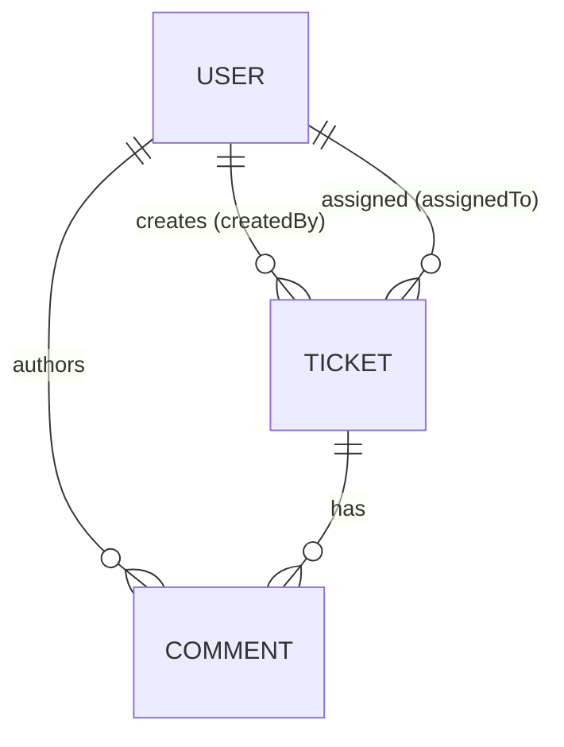

# Data Model

Database: SQLite (file-based). ORM: Prisma. Source of truth: `src/backend/prisma/schema.prisma`.

## Entities

### User (seeded only)

| Field | Type | Notes |
|---|---|---|
| id | String (cuid) | PK |
| name | String | |
| email | String | unique |
| role | String | ADMIN / AGENT (default AGENT) |

### Ticket

| Field | Type | Notes |
|---|---|---|
| id | String (cuid) | PK |
| title | String | required, 3-140 chars |
| description | String | required, 5-5000 chars |
| priority | String | LOW / MEDIUM / HIGH (default MEDIUM) |
| status | String | OPEN / IN_PROGRESS / RESOLVED / CLOSED / CANCELLED (default OPEN) |
| assignedTo | String? | FK -> users.id (nullable) |
| createdBy | String | FK -> users.id |
| createdAt | DateTime | default now() |
| updatedAt | DateTime | auto-updated |

Indexes: `status`.

### Comment

| Field | Type | Notes |
|---|---|---|
| id | String (cuid) | PK |
| ticketId | String | FK -> tickets.id (cascade delete) |
| message | String | required, 1-2000 chars |
| createdBy | String | FK -> users.id |
| createdAt | DateTime | default now() |

Indexes: `ticketId`.

## Relationships

## Enum handling

SQLite lacks native enums. `priority` and `status` are stored as strings and constrained
by the application layer: Zod validates the request shape and the state machine
(`lib/stateMachine.ts`) governs legal status transitions. Constants live in
`src/backend/src/lib/domain.ts` so validation, the state machine, and seed data cannot drift.
