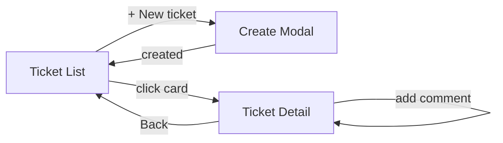

# UI Flow

## Screens

1. Ticket List (`/`)
   - Header with brand and an "Acting as" user selector (stand-in for auth).
   - Toolbar: debounced keyword search + status filter chips (All / Open / In Progress / Resolved / Closed / Cancelled).
   - Responsive card grid; each card shows status + priority badges, title, truncated description, assignee, and last-updated time.
   - "+ New ticket" opens the create modal.
   - States: loading panel, error panel with Retry, empty panel when no matches.

2. Create Ticket (modal)
   - Fields: title, description, priority, assignee (optional).
   - Client-side validation mirrors backend rules; backend remains authoritative.
   - On success: toast + list invalidation + close.

3. Ticket Detail (`/tickets/:id`)
   - Main column: badges, title/description (with inline Edit form), comment thread + add-comment form.
   - Side column:
     - Status card: current status + buttons for each allowed transition (rendered from `allowedTransitions`). Terminal states show an explanatory note instead of buttons.
     - Details card: assignee, reporter, created/updated timestamps.
   - Every mutation shows a success/error toast; errors (e.g. 409 invalid transition) are surfaced verbatim from the backend.

## Primary user journey

## How invalid transitions are handled in the UI

- The detail view only renders buttons for transitions the backend reports as allowed, so illegal moves are not offered.
- If a transition is nonetheless rejected (e.g. the page is stale), the 409 message is shown as an error toast and the ticket is refetched to reflect the true state.
